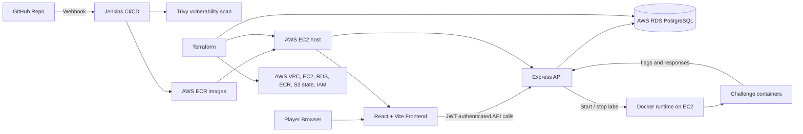

# CTF Platform

A self-hosted Capture The Flag platform built for security training and DevSecOps practice. Players log in, launch challenge containers, submit flags, and compete on a live leaderboard while the platform is deployed and operated on AWS.

## Architecture

## What’s In The Stack

- Frontend: React, Vite, React Router, Axios, Lucide icons.
- Backend: Node.js, Express, PostgreSQL, JWT auth, bcrypt password hashing.
- Challenge labs: Dockerized targets, including a custom SQLi lab backed by SQLite.
- Infrastructure: Terraform-managed AWS VPC, EC2, RDS PostgreSQL, ECR, IAM, and S3 remote state.

## DevOps Tooling

- Terraform provisions the AWS footprint, including the network, EC2 host, RDS database, ECR repositories, IAM role, and remote state backend.
- GitHub webhooks trigger Jenkins automatically on push.
- Jenkins builds the backend container, runs Trivy, publishes the image to ECR, and deploys the updated backend.
- Trivy blocks releases when it finds critical vulnerabilities in the container image.
- Docker runs the backend, Jenkins, SonarQube, and the challenge labs on the EC2 host.
- SonarQube is used during host bootstrap for code quality checks and pipeline integration.
- k3s is installed during host setup to support namespaced challenge isolation and future orchestration.

## Main Capabilities

- User signup and login with JWT-based authentication.
- Challenge listing and challenge launching from the dashboard.
- Dynamic per-user challenge flags for the SQLi lab.
- Flag submission with score tracking and duplicate protection.
- Live leaderboard backed by PostgreSQL.
- External challenge support for lab instances hosted outside the main app.

## Repository Layout

- terraform/ contains the AWS infrastructure code.
- platform/backend/ contains the Express API and PostgreSQL integration.
- platform/frontend/ contains the React dashboard and flag submission UI.
- platform/custom-sqli/ contains the standalone SQL injection target.
- Jenkinsfile defines the CI/CD pipeline.
- setup.md explains how to host the platform yourself.

## Contributors

- Pradnyesh - built the AWS infrastructure from the ground up using Terraform, including EC2, RDS, ECR, IAM, VPC, and S3 remote state, and set up the CI/CD pipeline with GitHub webhooks, Jenkins, and Trivy.
- Simarjyot - built the backend of the CTF platform with Express, including login, challenge handling, challenge container orchestration, and the leaderboard flow.
- Aaditya - built the frontend, connected it to the backend, added live container status on the challenge dashboard, and integrated the UI with the external challenge EC2 and leaderboard updates.
- Swayam - built the dedicated target machine challenge on a separate EC2, including the multi-flag setup and hidden flags spread across the system.

## Local Development

For self-hosting and deployment steps, use [setup.md](setup.md). That guide covers Terraform, EC2 bootstrap, Jenkins, Trivy, and backend deployment.